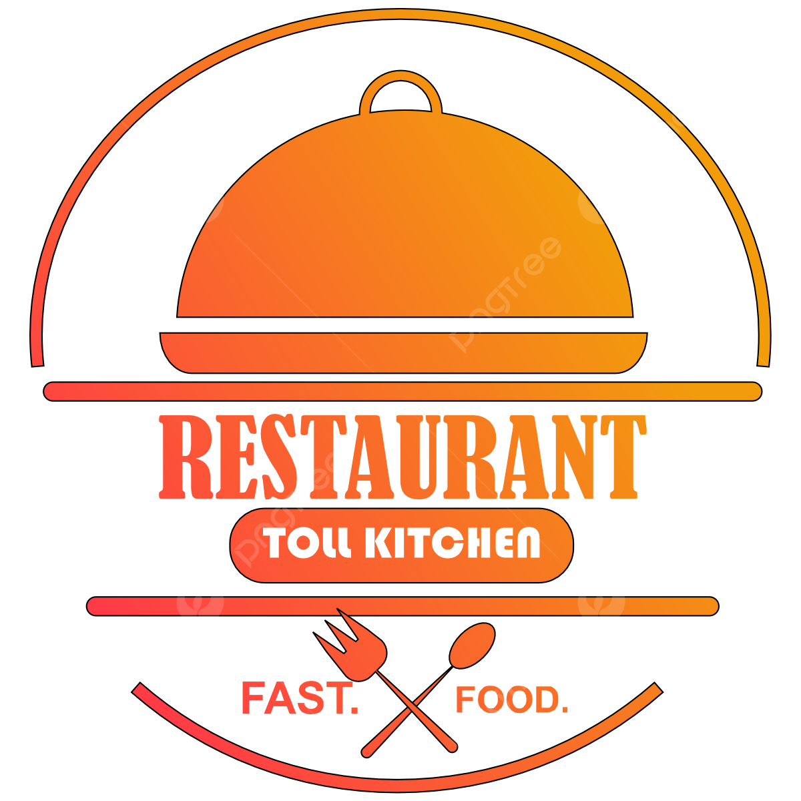
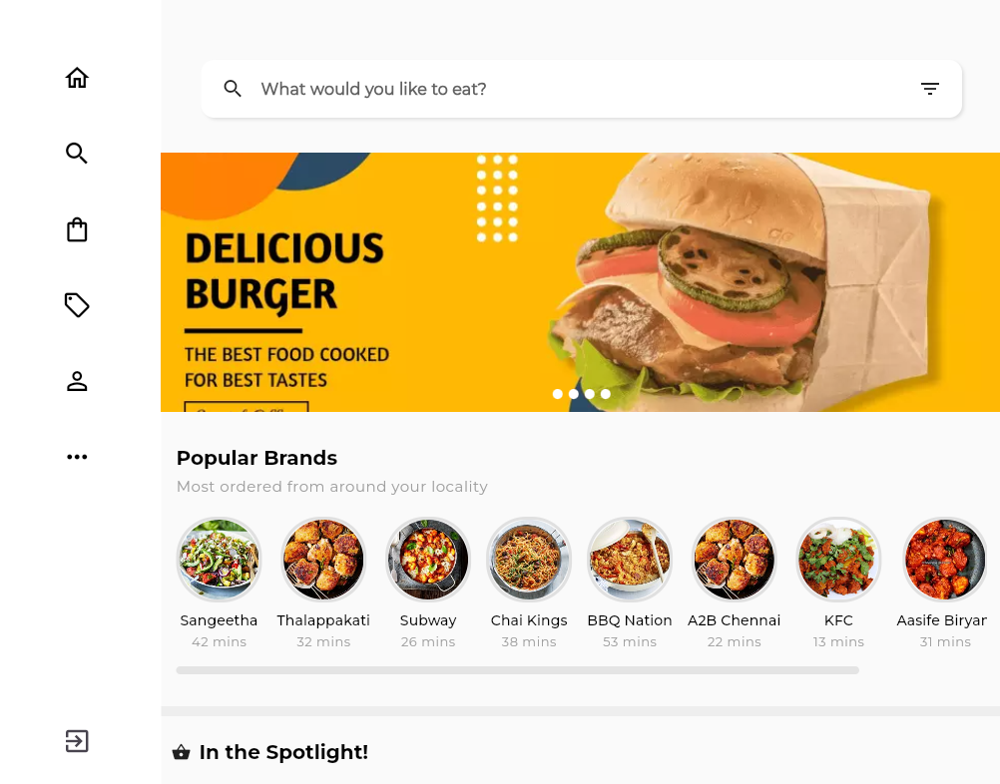
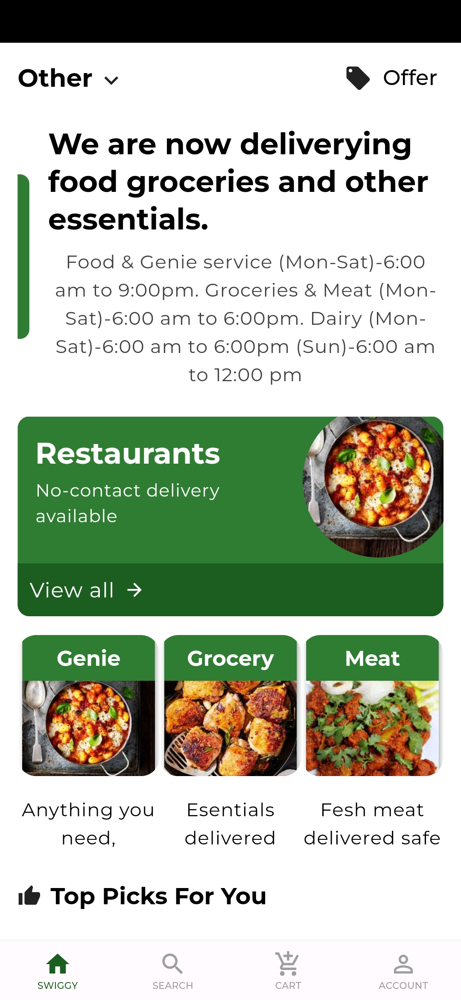

# 🍽️ Food Restaurant UI

A beautifully designed **Food Restaurant UI** app, which is a clone of a famous food ordering app, built using Flutter. Show some ❤️ by starring ⭐ this repository if you like it, as it encourages me to share more open-source Flutter projects.

###### Contact for work, email: [chunhthanhde.dev@gmail.com](mailto:chunhthanhde.dev@gmail.com)

## 🍎 Overview

**Food Restaurant UI** is a Flutter-based user interface inspired by popular food ordering applications. The UI is responsive and adapts beautifully across web, tablet, and mobile platforms.

## 🌟 Features

- **Responsive UI**: Works perfectly on web, tablet, and mobile devices.
- **Modern Design**: Clean, intuitive, and user-friendly interface.
- **Cross-Platform Compatibility**: Available for Android, iOS, and web.

## 🛠️ Packages Used

| Package                                                                 | Version | Description                                                                                              |
| ----------------------------------------------------------------------- | ------- | -------------------------------------------------------------------------------------------------------- |
| [flutter_rating_bar](https://pub.dev/packages/flutter_rating_bar)        | ^4.0.1  | Allows creating customizable rating bars, perfect for displaying restaurant or meal ratings.              |
| [card_swiper](https://pub.dev/packages/card_swiper)                      | ^3.0.1  | A simple and elegant swiper for cards, great for showcasing menus, featured dishes, or promotions.        |
| [google_fonts](https://pub.dev/packages/google_fonts)                    | ^6.2.1  | Provides easy access to Google Fonts, ensuring beautiful and consistent typography throughout the app.     |
| [shimmer](https://pub.dev/packages/shimmer)                              | ^3.0.0  | Adds a shimmer effect, typically used as a loading placeholder to give a modern and polished feel.         |

## 🖥️ Screenshots

### 💻 Web UI

### 🔷 Tablet UI

### 📱 Mobile UI

For more screenshots, visit the folder [Screenshots](https://github.com/ChunhThanhDe/Food-Restaurant-UI/tree/main/screenshots).

## 🌟 Conclusion

If you're looking for a clean, modern food ordering app UI built in Flutter, then this project is for you! Download the APK below to explore the app on your mobile device.

📱 **Mobile**: [Download APK](https://github.com/ChunhThanhDe/Food-Restaurant-UI/releases/download/v0.0.1/app-release.apk)

## Star History

<a href="https://star-history.com/#chunhthanhde/Food-Restaurant-UI&Date">
 <picture>
   <source media="(prefers-color-scheme: dark)" srcset="https://api.star-history.com/svg?repos=chunhthanhde/Food-Restaurant-UI&type=Date&theme=dark" />
   <source media="(prefers-color-scheme: light)" srcset="https://api.star-history.com/svg?repos=chunhthanhde/Food-Restaurant-UI&type=Date" />
   
 </picture>
</a>

